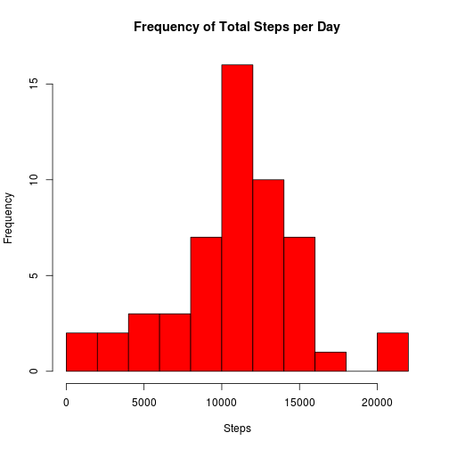
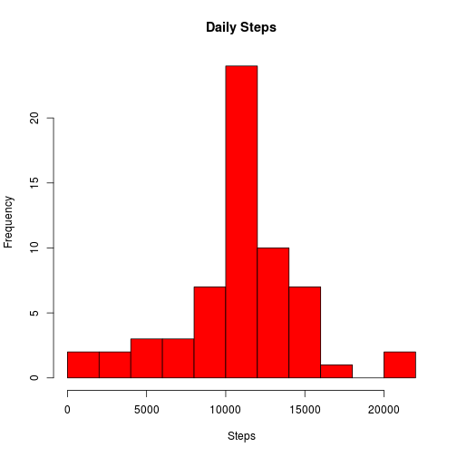
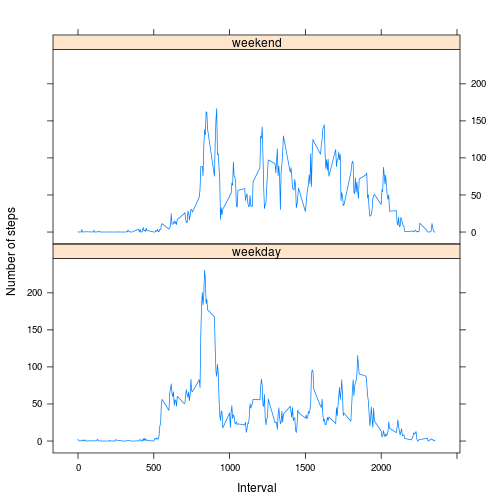

Reproducible Research - Peer Assessment 1
========================================================
by *Ashok Naren*  
github repo with RMarkdown source code:
https://github.com/transformer99/RepData_PeerAssessment1  


This is my solution for peer assessment 1.


## Loading and preprocessing the data

The code below checks if the data file exists in the current folder. If not, the script downloads the raw data from internet. If the data is already available in the working directory, the downloading step will be skipped. The code will then unzip the downloaded data (in .zip format) and load the data into memory.

The date variable will then be converted in the Date format and the interval variable will be treated as factor (so it can be used as a grouping variable).

Nothing will be outputed from this section of code. 

Please make sure you are online if you don't have the data in place, or the code might fail downloading the required data. This part of code is tested only under Linux. You might need to modify the *method* parameter for the download.file() function to suit your system.


```r
dataURL <- "https://d396qusza40orc.cloudfront.net/repdata%2Fdata%2Factivity.zip"

### Download data
if (file.exists("./activity.zip") || file.exists("./activity.csv")) {
  message("== Data file (zip or csv format) exists, skipping downloading step \r")
  
} else {

  message("== Downloading data file...\r")
  download.file(url=dataURL,destfile="./activity.zip",method="wget")
  
}
```

```
## == Data file (zip or csv format) exists, skipping downloading step 
```

```r
### Extract data
if (file.exists("./activity.csv")) {
  message("== Data file (csv format) exists, skipping extraction...\r")
} else {
  message("== Extracting data ... \r")
  unzip(zipfile="./activity.zip",exdir="./",)  
}
```

```
## == Data file (csv format) exists, skipping extraction...
```

```r
### Load data
activityData <- read.csv("./activity.csv")

#data$date <- as.Date(data$date,format="%Y-%m-%d")
#data$interval <- as.factor(data$interval)
```


## What is mean total number of steps taken per day?
For the next few steps we need the data aggregated per day.

```r
dailyData <- aggregate(steps ~ date, activityData, FUN=sum)
```

### 1. Show a histogram

```r
hist(dailyData$steps, main="Frequency of Total Steps per Day", xlab="Steps", breaks=10, col="red")
```

 


### 2. Mean and Median

```r
myMean <- mean(dailyData$steps)
myMean
```

```
## [1] 10766
```

```r
myMedian <- median(dailyData$steps)
myMedian
```

```
## [1] 10765
```

The mean steps per day is **10766** and the median is **10765**.


## What is the average daily activity pattern?

### 1. Time series plot
Find the average (mean) number of steps for each time interval across all days, and graph it.

```r
intervalAgg <- aggregate(steps ~ interval, activityData, FUN=mean)
plot(intervalAgg$interval, intervalAgg$steps,type="l", ylab="Avgerage Number of Steps", xlab="Interval")
```

 

### 2. Find the max interval

```r
maxInterval <- intervalAgg[intervalAgg$steps==max(intervalAgg$steps),]
maxInterval
```

```
##     interval steps
## 104      835 206.2
```

The interval with the highest average is **835** with an average number of steps of **206.1698**.

## Imputing missing values


### 1. How many NA values in the data?

Note that the date and interval columns are always populated so we only need to check the steps column for NA values.

```r
navalues <- is.na(activityData$steps)
nacount <- sum(navalues)
nacount
```

```
## [1] 2304
```
There are **2304** records with NA steps.

### 2. Populate the missing values

Approach:  For imputing the missing values, it will be reasonably accurate to populate each record with the mean value for that interval.  There is probably a way to do this in a single line, replacing the values inline.  But this is straightforward enough that I'm not going to try to optimize it more.  This isn't a giant dataset where it would be worthwhile to highly optimize.


```r
#Pull out only the rows we want to manipulate
naRows <- activityData[is.na(activityData),]

#Do a join with the data.frame containing the mean values for each interval
mergedRecords <- merge(naRows, intervalAgg, by="interval")

#Throw out the original Step value and replace it with the new mean value in column 4
newdata <- mergedRecords[,c(4,3,1)]
colnames(newdata) <- c("steps", "date", "interval")

#And finally assemble a new data.frame that combines the good data with this new modified data.
goodRecords <- na.omit(activityData)
fullData <- rbind(goodRecords, newdata)
```

Now aggregate it for each day, and create a histogram


```r
fullDailyData <- aggregate(steps ~ date, fullData, FUN=sum)
hist(fullDailyData$steps, main="Daily Steps", xlab="Steps", breaks=10, col="red")
```

 

This histogram looks quite similar to the histogram above.  The only difference is that there are more records in the middle bucket.  This makes sense, since we just manufactured a bunch of records based on mean values.


And now calculate the mean/median of the new data.

```r
newMean <- mean(fullDailyData$steps)
newMedian <- median(fullDailyData$steps)
```

In this modified data, mean steps per day is **10766** and the median is **10766**.  This compares to values of **10766** and **10765** in the above steps.  The mean has not changed, but the median has changed slightly.

Conclusion: Setting the NA values to the median has a minor effect on the data when looking at the mean/median values. However, it does increase the shape of the histogram and make the data appear more dense than it would likely be if actual values were available.

## Are there differences in activity patterns between weekdays and weekends?

For this part of the assignment we'll continue using the fully populated data with the NA values imputed.

Find the weekday for each date, then figure out if that day is on a weekend or not. 

```r
#Add a new column to the data with name of the day of the week
fullData$weekday <- weekdays(as.POSIXlt(fullData$date))

#Add a new column with TRUE/FALSE values, if the day of the week is on a weekend then TRUE
t <- as.factor(fullData$weekday %in% c("Saturday","Sunday"))

#Convert the TRUE/FALSE values to more user friendly values by overriding the label names in the factor
levels(t) <- c("weekday","weekend")

#Add this column to the data.frame. The weekday column will be there too, but that isn't a big deal. There isn't any requirement to remove it.
fullData$weekend <- t

#Finally, do an aggregation on the steps for each interval, additionally segmented by the new weekend column
weekendAgg <- aggregate(steps ~ interval + weekend, fullData, FUN=mean)

head(weekendAgg)
```

```
##   interval weekend   steps
## 1        0 weekday 2.25115
## 2        5 weekday 0.44528
## 3       10 weekday 0.17317
## 4       15 weekday 0.19790
## 5       20 weekday 0.09895
## 6       25 weekday 1.59036
```


Now make a plot

```r
library(lattice)

xyplot(steps ~ interval | weekend, weekendAgg, type="l", layout=c(1,2), xlab="Interval", ylab="Number of steps")
```

 
